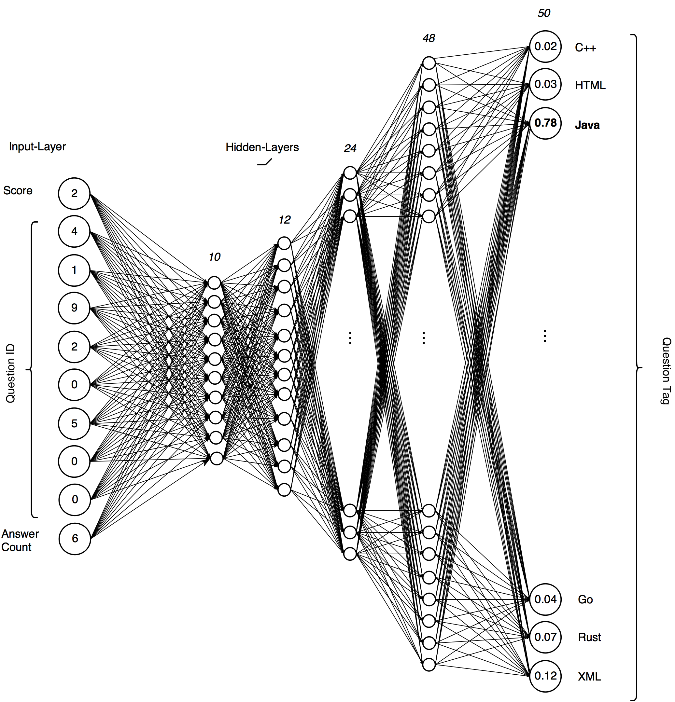

## Tagging Stack-Overflow questions with deep neural networks
Project idea from [Awesome Deep Learning Project Ideas](https://github.com/NirantK/awesome-project-ideas)

#### Data
The training data set was originally downloaded from ["StackLite: Stack Overflow questions and tags"](https://www.kaggle.com/stackoverflow/stacklite)
and are formally licenced by [Stack Exchange, Inc.](https://archive.org/details/stackexchange) under [cc-by-sa 3.0](http://creativecommons.org/licenses/by-sa/3.0/).
It contains the question score and answer count as well as the anonymous ID of it's owner. The neural net tries to maps this vector to one of the 50 frequently
used questions tags like *java*, *c++* or *html*.

#### Neural network
The neural net was implemented as computational graph with the popular machine learning library [TensorFlow](https://www.tensorflow.org/). You can find my model in the following Python module:
[src/model.py](https://github.com/erohkohl/question-tagging/blob/master/src/model.py). The below picture shows the network architecture. It consists of four hidden layers with 10, 12, 24 and 48 neurons. Each neuron in the hidden layers
has a [ReLU](https://en.wikipedia.org/wiki/Rectifier_(neural_networks)) activation. Further neural net's output layer holds one neuron
for each question tag and applies [Softmax](https://en.wikipedia.org/wiki/Softmax_function) function to their activation for classification purpose.


#### Train model
To train model, simply run the following command in the root folder of this project. Therefore Python 3
is recommended and Google's TensorFlow and [matplotlib](https://matplotlib.org/) are required.
```bash
$ python src/model.py
```

#### Results
This models reaches an accuracy of over **85%** for training and test data set. The below picture shows models loss
in relation to training epoch.


